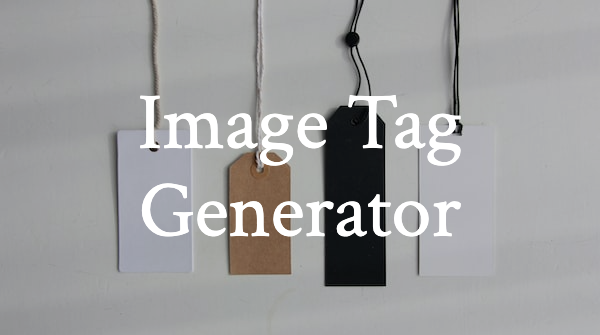

<h1 align="center">IMGTAGGEN</h1>

<p align="center">
<a href="https://imgtaggen.codewithshin.com/" rel="nofollow">Image Tag Generator</a>
</p>

<p align="center">
<a href="https://github.com/sponsors/shinokada" target="_blank"></a>
<a href="https://developer.mozilla.org/en-US/docs/Web/Progressive_web_apps"></a>
<a href="https://www.npmjs.com/package/imgtaggen" rel="nofollow" target="_blank"></a>
<a href="https://twitter.com/shinokada" rel="nofollow" target="_blank"></a>
<a href="https://opensource.org/licenses/MIT" rel="nofollow" target="_blank"></a>
<a href="https://www.npmjs.com/package/imgtaggen" rel="nofollow" target="_blank"></a>
</p>

A CLI tool for generating a responsive image tag with support for AVIF and WebP formats. It will also calculate image ratio.

It is recommended to use this script in conjunction with [bimgc](https://www.npmjs.com/package/bimgc).

<p align="center">
<picture>
  <source
    type="image/avif"
    srcset="public/images/imgtaggen.avif?width=100 100w, public/images/imgtaggen.avif?width=200 200w, public/images/imgtaggen.avif?width=400 400w, public/images/imgtaggen.avif?width=800 800w" />
  <source
    type="image/webp"
    srcset="public/images/imgtaggen.webp?width=100 100w, public/images/imgtaggen.webp?width=200 200w, public/images/imgtaggen.webp?width=400 400w, public/images/imgtaggen.webp?width=800 800w" />
  
</picture>
</p>

## Installation

```
npm i -g imgtaggen
imgtaggen --version
cd path/to/your/project
```

## Options

imgtaggen [args]

|Options|Description|Default|
|--|--|--|
|--noavif|Do not generate an AVIF image tag |[boolean] [default: false]|
|--nowebp|Do not generate a WEBP image tag |[boolean] [default: false]|
|--noclipboard|Do not copy the image tag to the clipboard|[boolean] [default: false]|
|--version|Show version number ||
|--help|Show help||


## Usages

Add an image path with `imgtaggen` command.

```bash
imgtaggen public/images/imgtaggen.png
```

This will copy the following to your clipboard.

```html
<picture>
  <source
    type="image/avif"
    srcset="public/images/imgtaggen-100.avif?width=100 100w, public/images/imgtaggen-200.avif?width=200 200w, public/images/imgtaggen-400.avif?width=400 400w, public/images/imgtaggen-800.avif?width=800 800w" />
  <source
    type="image/webp"
    srcset="public/images/imgtaggen-100.webp?width=100 100w, public/images/imgtaggen-200.webp?width=200 200w, public/images/imgtaggen-400.webp?width=400 400w, public/images/imgtaggen-800.webp?width=800 800w" />
  
</picture>
```

You just need to paster it and modify the `alt` text and `sizes` values to match your requirements.

## Sizes

The default outputs are 100, 200, 400, and 800. To specify a different set of outputs, use the -s or --sizes option.

```bash
imgtaggen public/images/imgtaggen.png -s 100 200
```

Output:

```html
<picture>
  <source
    type="image/avif"
    srcset="public/images/imgtaggen-100.avif?width=100 100w, public/images/imgtaggen-200.avif?width=200 200w" />
  <source
    type="image/webp"
    srcset="public/images/imgtaggen-100.webp?width=100 100w, public/images/imgtaggen-200.webp?width=200 200w" />
  
</picture>
```

## alt option

The default alt text is "My awesome image", and you can use the `-a` or
`--alt` option to specify a different alt text.

```bash
imgtaggen public/images/imgtaggen.png -a 'My alt text'
```

Output:

```html
<picture>
  <source
    type="image/avif"
    srcset="public/images/imgtaggen-100.avif?width=100 100w, public/images/imgtaggen-200.avif?width=200 200w, public/images/imgtaggen-400.avif?width=400 400w, public/images/imgtaggen-800.avif?width=800 800w" />
  <source
    type="image/webp"
    srcset="public/images/imgtaggen-100.webp?width=100 100w, public/images/imgtaggen-200.webp?width=200 200w, public/images/imgtaggen-400.webp?width=400 400w, public/images/imgtaggen-800.webp?width=800 800w" />
  
</picture>
```

## No avif block

The option `--noavif` will not output avif block.

```bash
imgtaggen public/images/imgtaggen.png --noavif
```

Output:

```html
<picture>
  <source
    type="image/webp"
    srcset="public/images/imgtaggen-100.webp?width=100 100w, public/images/imgtaggen-200.webp?width=200 200w, public/images/imgtaggen-400.webp?width=400 400w, public/images/imgtaggen-800.webp?width=800 800w" />
  
</picture>
```

## No webp block

The option `--nowebp` will not output avif block.

```bash
imgtaggen public/images/imgtaggen.png --nowebp
```

Output:

```html
<picture>
  <source
    type="image/avif"
    srcset="public/images/imgtaggen-100.avif?width=100 100w, public/images/imgtaggen-200.avif?width=200 200w, public/images/imgtaggen-400.avif?width=400 400w, public/images/imgtaggen-800.avif?width=800 800w" />
  
</picture>
```

## No webp & no avif

```bash
imgtaggen public/images/imgtaggen.png --nowebp --noavif
```

Output:

```html
<picture>
  
</picture>
```

## No clipboard

The option`--noclipboard` will display the output in the terminal instead of copying it to the clipboard.

```bash
imgtaggen public/images/imgtaggen.png --noclipboard
```

This command outputs the following on your terminal.

```html
Generating image tag...
noavif: false
nowebp: false
noclipboard: true
sizes: [ 100, 200, 400, 800 ]
input file: public/images/imgtaggen.png
<picture>
  <source
    type="image/avif"
    srcset="public/images/imgtaggen-100.avif?width=100 100w, public/images/imgtaggen-200.avif?width=200 200w, public/images/imgtaggen-400.avif?width=400 400w, public/images/imgtaggen-800.avif?width=800 800w" />
  <source
    type="image/webp"
    srcset="public/images/imgtaggen-100.webp?width=100 100w, public/images/imgtaggen-200.webp?width=200 200w, public/images/imgtaggen-400.webp?width=400 400w, public/images/imgtaggen-800.webp?width=800 800w" />
  
</picture>
```

## Use this with bimgc

[bimgc](https://bimgc.codewithshin.com/) is a CLI tool for converting PNG and JPG images to AVIF and WebP format with various sizes and saves them in a specified output directory. The output images are named based on the input file and include information about their size and format.

Use `bimgc` in conjunction with `imgtaggen`.

## Reference

- Read more about [Optimal Images in HTML](https://www.builder.io/blog/fast-images)
- Find out more about [Batch Image Converter: bimgc](https://bimgc.codewithshin.com/)

## PWA: Fast & Offline

The [docs website](https://imgtaggen.codewithshin.com/) can be downloaded and installed on your device for offline access as a Progressive Web App.

To install a PWA, look for the "Add to Home Screen" option in the browser's menu or settings. On most mobile devices, this option can be found by visiting the website, then selecting the "Options" or "Menu" button in the browser, and looking for the "Add to Home Screen" option. On some desktop browsers, right-click on the page and select "Install".

